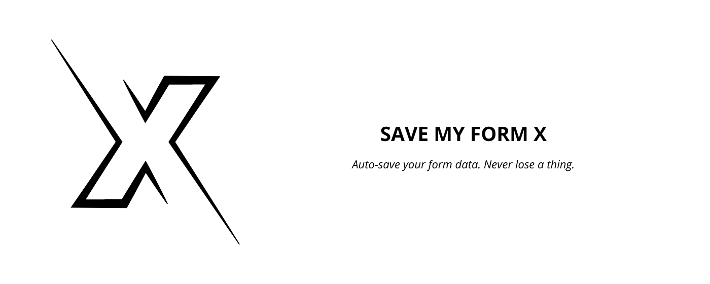

# SaveMyFormX

**SaveMyFormX** is a lightweight Chrome extension that automatically saves your form inputs, preventing data loss due to accidental reloads, crashes, or logouts.



---

## 🚀 Features

- 🔒 Auto-saves form fields (`input`, `textarea`, `checkbox`) as you type
- 🧠 Remembers your data even after closing or refreshing the tab
- ⚡️ Restores saved data automatically on revisit
- 🧹 Clear all data anytime via the popup
- 🧼 Lightweight and fast — works silently in the background

---

## 📦 Installation

1. Clone or download this repository:

```bash
git clone https://github.com/Torresnova-Studio/SaveMyFormX.git
```

2. Open Chrome and go to `chrome://extensions/`

3. Enable **Developer Mode** (top right corner)

4. Click **Load unpacked** and select the `SaveMyFormX` folder

5. Done! The extension is now active.

---

## 🔐 Permissions & Privacy

### 🔍 Why we request permissions:

- **`storage`**: To store your form inputs safely on your own browser.
- **`activeTab` + `scripting`**: To inject scripts only on user-requested pages (when popup is clicked).
- **`host_permissions: ["<all_urls>"]`**: Needed to detect forms on any webpage and auto-restore fields after refresh or crash.

> **Important:** We do **not** collect, transmit, or share any of your data. All storage happens **locally** inside your own browser using the `chrome.storage.local` API.

### ✅ Your privacy is safe

- No external server is involved.
- No tracking, analytics, or cookies.
- You can clear all saved data anytime from the popup.

---

## 📄 Privacy Policy

**Last updated:** April 14, 2025

SaveMyFormX is a Chrome Extension that automatically stores your form input data **locally** on your device to prevent data loss.

### What data do we collect?

The extension temporarily captures text entered into input fields of online forms.

### How do we use your data?

All data is stored **only** in your local browser storage. It is **never transmitted** or shared with any third party or external server.

### Do we share your data?

Absolutely not. Your data **stays on your device**.

### How can you manage or delete your data?

Click the “🧹 Clear” button in the extension popup to delete everything saved by SaveMyFormX.

### Contact

For any questions or suggestions:  
📫 **torresnovastudio@gmail.com**

---

## 📁 Project Structure

```
SaveMyFormX/
│
├── icons/                    # Extension icons (16, 48, 128 px)
├── assets/                   # Marketing banner and visuals
├── background.js             # Handles events like installation or tab updates
├── content.js                # Injected script for capturing/restoring input
├── popup.html                # UI for user interaction
├── popup.js                  # Logic for popup actions
├── manifest.json             # Chrome extension configuration
├── privacy-policy.md         # Privacy policy in markdown format
└── README.md                 # You are here 🚀
```

---

## 👨‍💻 Contributing

We welcome contributions from the community! 🙌

1. Fork the repository  
2. Create a feature branch:  
   ```bash
   git checkout -b feature/amazing-feature
   ```  
3. Commit your changes  
4. Push to your fork:  
   ```bash
   git push origin feature/amazing-feature
   ```  
5. Submit a Pull Request 🚀

---

## ⚖️ License

### MIT License

```
MIT License

Copyright (c) 2025 Torresnova Studio

Permission is hereby granted, free of charge, to any person obtaining a copy
of this software and associated documentation files (the "Software"), to deal
in the Software without restriction, including without limitation the rights
to use, copy, modify, merge, publish, distribute, sublicense, and/or sell
copies of the Software, and to permit persons to whom the Software is
furnished to do so, subject to the following conditions:

The above copyright notice and this permission notice shall be included in
all copies or substantial portions of the Software.

THE SOFTWARE IS PROVIDED "AS IS", WITHOUT WARRANTY OF ANY KIND, EXPRESS OR
IMPLIED, INCLUDING BUT NOT LIMITED TO THE WARRANTIES OF MERCHANTABILITY,
FITNESS FOR A PARTICULAR PURPOSE AND NONINFRINGEMENT. IN NO EVENT SHALL THE
AUTHORS OR COPYRIGHT HOLDERS BE LIABLE FOR ANY CLAIM, DAMAGES OR OTHER
LIABILITY, WHETHER IN AN ACTION OF CONTRACT, TORT OR OTHERWISE, ARISING FROM,
OUT OF OR IN CONNECTION WITH THE SOFTWARE OR THE USE OR OTHER DEALINGS IN
THE SOFTWARE.
```

---

## 📬 Contact

Made with ❤️ by **Torresnova Studio**  
GitHub: [https://github.com/Torresnova-Studio](https://github.com/Torresnova-Studio)  
Email: [torresnovastudio@gmail.com](mailto:torresnovastudio@gmail.com)

---

**SaveMyFormX** — _Never lose your form data again._
